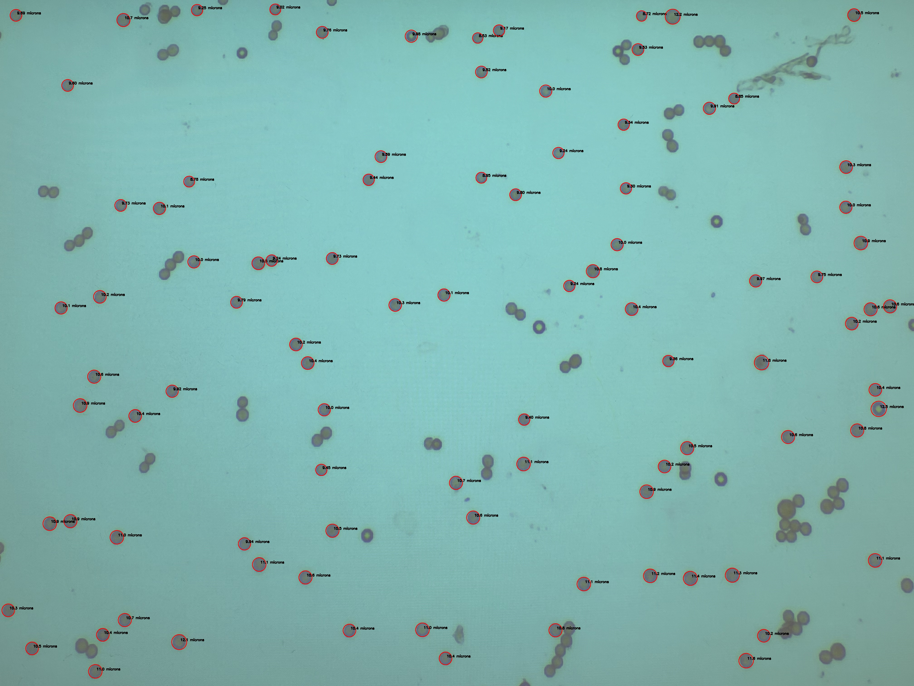

# *Physarum polycephalum* Spore Analysis
>A project implemented in C++ that detects, measures, and analyzes *P. polycephalum* spores from microscopy images to support my brother's research.

## Features
* Reads a JPG and converts it to grayscale for better contrast
* Uses adaptive thresholding to separate the spores from background.
* Applies additional parameters based on area, circularity, convexity, and inertia ratio.
* Measurement of spores calibrated to scale using marked nonionic polystyrene microspheres (beads) in the microscopy images.
* Filters out spores that are touching, smudges, beads, and any other irrelevant objects. 
* Ouputs a JPG with outlined and annotated spores.

## *Physarum polycephalum*
*P. polycephalum* in its spore state is a unicellular protist slime mold that is commmonly used in biology research. The research this project assists in is focused on analyzing the rate of growth and spore size variance as a result of medias with varying salinity. *P. polycephalum* spores appear as small, nearly circular blobs, sometimes overlapping. 

Learn more about *P. polycephalum* [here](https://en.wikipedia.org/wiki/Physarum_polycephalum).

## Spore Detection in Action
<p align="center">
  
  
</p>

## How to Compile and Run
Clone this repository
```bash
git clone https://github.com/DavidSchineis/Physarum-Spore-Analysis.git
```

Ensure OpenCV4 is installed 
```bash
brew install opencv pkg-config
```

Compile the program
```bash
g++ -std=c++17 spore_detector.cpp -o spore_detector `pkg-config --cflags --libs opencv4`
```

Run the program
```bash
./spore_detector
```
